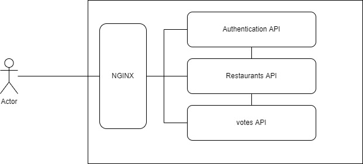

# mindtales-lunch-menu-assessment

A solution to the MindTales' assessement for the Python Backend position. You may find the assessment's specifications at [url]here
This solution proposes the below architecture to achieve High Availability

## temporaty live version for testing
Hosted on an dedicated AWS EC2 server at http://13.244.78.170

## Running the solution
To start/run the proposed solution, please proceed as follows:
* Grant execution permission to deploy.sh

> chmod +x deploy.sh

* Because the deployment uses an NGINX service listening on port 80, please make sure nothing else listens to the same port. My favourite way of killing anything running on a port is(requires npm):

> npx kill-port PORT_NUMBER

* Or make sure no similar service such as a local NGINX installation is running

> sudo systemctl stop nginx

* Then run the script

> ./deploy.sh

## Authentication
API requires authenticated access on most endooints by default. Send a POST request with username and email to `auth/token` to obtain an authentication token.

Subsequent requests will require includding the returned token in the request's headers as follows:
`Authorization: Token [TOKEN]`

### superuser
The superuser account is created when the migrations are run for the first time using a data-migration script inside services/auth/core/migrations. The credentials can be supplied or edited inside `global-django.env`. This file contains shared settings accross django projects. service-level enviroment variables are located inside `services/[service-name-folder]/.env`

## Services
### reverser
Runs on port 80
Used to demonstrate how the load-balancer could be the first entrypoint to the system. Uses the latest version of NGINX.

### Postgres service
Runs on port 5432
Database service for storing of data. 
I recommend using a service such as Amazon RDS 

### Authentication API
Runs on port 3000. This is the authentication service handling all requests to the following routes:

- /auth
- /employees
- /restaurant-managers

Each of the other services require the **auth** service to authenticate incoming requests using a custom aunthentication method. See `services/[service-name-folder]/src/authentication.py`

    Create an employee
    POST /employees/ (superuser only)
    {
        "username": "employee",
        "email": "emp@mindtales.com",
        "password": "another_password"
    }

    Create a manager
    POST /managers/ (superuser only)
    {
            "username": "manager1",
            "email": "manager1@restaurant1.com",
            "password": "another_password",
     }

### Restaurants API
Runs on port 3001 and allows management of restaurants and menu resources.
You would want to create a restaurant

    Create a restaurant
    POST /restaurants/ (superuser only)
    {
       "name": "some name",
       "manager": 5 // existing manager's user id
     }

Note that the manager object must exist already. See **auth** app above. Also note that the one-to-one relationship is only observed on the resturant table. An existing manager can be used to manage any other restaurant.

    Get a list of restaurants:
    GET /restaurants

Then add menus to it. A menu can only be submitted by a manager. 
    Get Restaurant Manager
    GET /restaurants/<slug:restaurant:id>/manager

    Create a menu
    POST /restaurants/<slug:restaurant:id/menus/ (restaurant managers only)
    {
        "drinks": [
            {"name": "Coca", "description": "2 Litre"},
            {"name": "Orange Juice"}
        ],
        "meals": [
            {"name": "Coca", "description": "2 Litre"},
            {"name": "Tuna and avocado salad"},
        ]
    }
An important endpoint is the one that allows collecting the list of the day's menus. 

    Get today's menus (Authenticated only)
    GET /restaurants/votable_menus

### Votes API
Runs on port 3002 and handles requests to /votes.
To cast a vote, the request's body must include entries of the form `{point: menu-id}`. The point can only be a value among 1,2, and 3. 

To differentiate between mobile clients that are still using an old version of the API, the header key represented by the environment variable  *API_HEADER_KEY_NAME* is checked by a middleware(*voteapi.middlewares.VersionControlMiddleware*) that redirects to the old view for build version <= to the value set inside the environment variable *OLD_API_MAX_BUILD*

	

    Old API
    POST votes/ (employees only)
    Add Header key Mobile-build-version.
    { "menu": <slug:menu_id> }
	
Note: The header key name too lookup can be changed from inside `global-django.env`

	Latest API
    POST votes/ (employees only)
    {
    	point: <slug:menu_id>,
        point: <slug:menu_id>,
    	point: <slug:menu_id>
    }

    A sample payload:
    {
        "1": "46d82b2c-bf56-4da8-a900-b616a6abdef1",
        "2": "7db1fe1a-7203-4545-851e-9cbfc586402b",
        "3": "1e1c74f7-61f7-4fde-9b41-563a503e2960"
    }

Getting the voting result for the day

    GET votes/results 
Returns the top 3 voted menus of the day

## Improvements
List of a few things that could improve the solution
- Authentication token expiry
